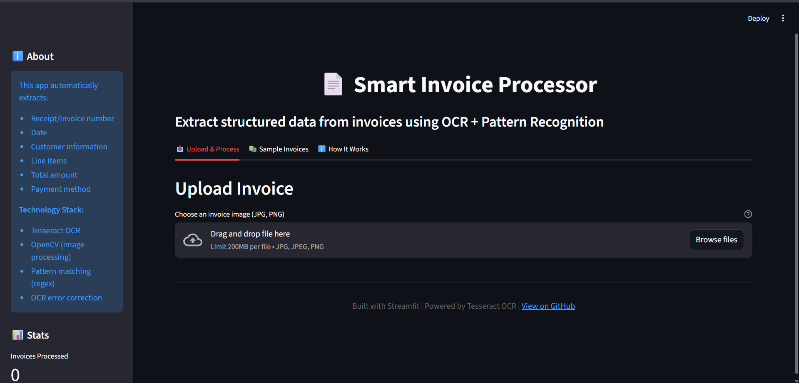
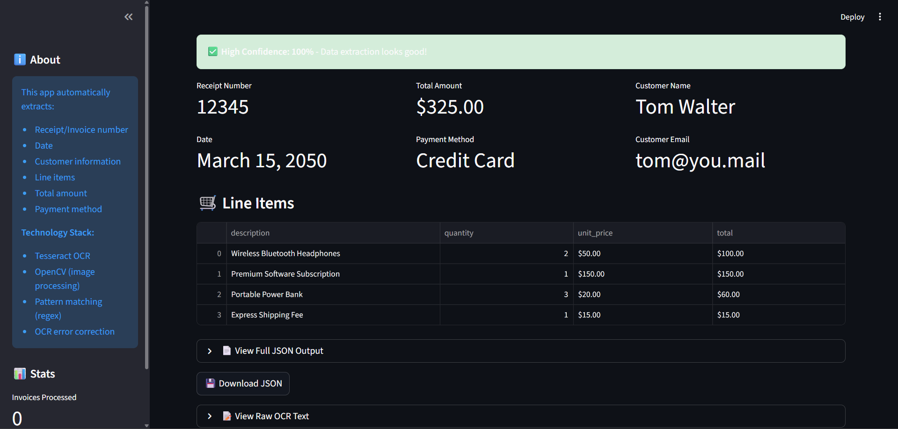
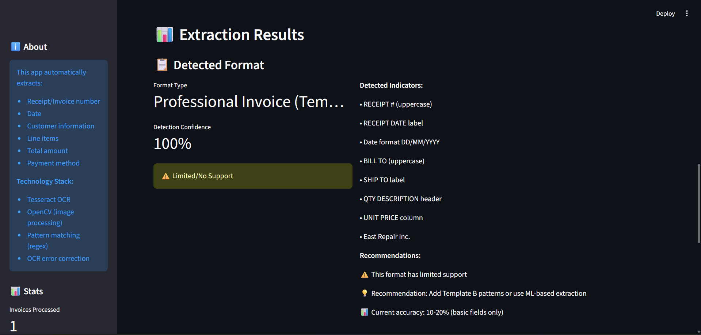

# 📄 Smart Invoice Processor

An end-to-end invoice processing system that automatically extracts structured data from scanned invoices and receipts using OCR and pattern recognition.


## 🎯 Features

- ✅ **Automatic Text Extraction** - OCR using Tesseract
- ✅ **Structured Data Output** - JSON format with all key fields
- ✅ **OCR Error Correction** - Fixes common character recognition mistakes
- ✅ **Confidence Scoring** - Reports extraction reliability
- ✅ **Format Detection** - Identifies invoice template type
- ✅ **Batch Processing** - Handle multiple invoices at once
- ✅ **Web Interface** - User-friendly drag-and-drop UI
- ✅ **Validation** - Automatic data consistency checks

## 📊 Demo

### Web Interface

*Clean, user-friendly interface for invoice upload*

### Successful Extraction (100% Confidence)

*All fields extracted correctly from supported format*

### Format Detection

*System identifies invoice type and explains confidence score*

### Extracted Data
```json
{
  "receipt_number": "12345",
  "date": "March 15, 2050",
  "bill_to": {
    "name": "Tom Walter",
    "email": "tom@you.mail"
  },
  "total_amount": 325.00,
  "extraction_confidence": 100,
  "items": [
    {
      "description": "Wireless Bluetooth Headphones",
      "quantity": 2,
      "unit_price": 50.0,
      "total": 100.0
    }
  ]
}
```

## 🚀 Quick Start

### Prerequisites
- Python 3.8+
- Tesseract OCR

### Installation

1. Clone the repository
```bash
git clone https://github.com/yourusername/invoice-processor
cd invoice-processor
```

2. Install dependencies
```bash
pip install -r requirements.txt
```

3. Install Tesseract OCR
- **Windows**: Download from [UB Mannheim](https://github.com/UB-Mannheim/tesseract/wiki)
- **Mac**: `brew install tesseract`
- **Linux**: `sudo apt install tesseract-ocr`

4. Run the web app
```bash
streamlit run app.py
```

## 💻 Usage

### Web Interface
```bash
streamlit run app.py
```
Then upload an invoice image and click "Extract Data"

### Batch Processing
```bash
python src/batch_process.py
```
Processes all images in `data/raw/` folder

### Python API
```python
from src.extract_fields_v3 import extract_receipt_fields_v3
import pytesseract
from PIL import Image

# Extract text
img = Image.open('invoice.jpg')
text = pytesseract.image_to_string(img)

# Extract structured data
data = extract_receipt_fields_v3(text)
print(data)
```

## 🏗️ Architecture

```
┌─────────────┐
│ Upload Image│
└──────┬──────┘
       │
       ▼
┌──────────────┐
│  OCR Engine  │ ← Tesseract
└──────┬───────┘
       │
       ▼
┌──────────────────┐
│ Error Correction │ ← Fix J→1, O→0
└──────┬───────────┘
       │
       ▼
┌──────────────────┐
│ Pattern Matching │ ← Regex extraction
└──────┬───────────┘
       │
       ▼
┌──────────────────┐
│   Validation     │ ← Logic checks
└──────┬───────────┘
       │
       ▼
┌──────────────┐
│ JSON Output  │
└──────────────┘
```

## 📁 Project Structure

```
invoice-processor/
│
├── data/
│   ├── raw/                    # Input invoice images
│   └── processed/              # Output JSON files
│
├── src/
│   ├── extract_fields_v3.py    # Main extraction logic
│   ├── detect_format.py        # Format detection
│   ├── batch_process.py        # Batch processing
│   └── simple_preprocess.py    # Image preprocessing
│
├── app.py                      # Streamlit web interface
├── requirements.txt
└── README.md
```

## 🎯 Extraction Accuracy

| Invoice Format | Accuracy | Status |
|----------------|----------|--------|
| **Template A** (Retail Receipts) | 95-100% | ✅ Fully Supported |
| **Template B** (Professional) | 10-20% | ⚠️ Limited Support |
| Other formats | Variable | ❌ Not Optimized |

## 📈 Performance

- **Processing Speed**: ~0.3-0.5 seconds per invoice
- **OCR Accuracy**: 94%+ character accuracy on clear images
- **Field Extraction**: 100% on supported formats

## ⚠️ Known Limitations

1. **Format Dependency**: Currently optimized for retail receipt format (Template A)
2. **Image Quality**: Requires clear, well-lit images for best results
3. **Pattern-Based**: Uses regex patterns, not ML (limited flexibility)
4. **Language**: English only

## 🔮 Future Enhancements

- [ ] Add ML-based extraction (LayoutLM) for multi-format support
- [ ] Support for handwritten invoices
- [ ] Multi-language OCR
- [ ] Table detection for complex line items
- [ ] PDF support
- [ ] Cloud deployment (AWS/GCP)
- [ ] API endpoints (FastAPI)

## 🛠️ Tech Stack

| Component | Technology |
|-----------|------------|
| OCR | Tesseract 5.0+ |
| Image Processing | OpenCV, Pillow |
| Pattern Matching | Python Regex |
| Web Interface | Streamlit |
| Data Format | JSON |

## 📚 What I Learned

- **OCR challenges**: Character confusion (1/I/l/J), image quality dependency
- **Real-world ML**: Handling graceful degradation for unsupported formats
- **Pipeline design**: Building robust multi-stage processing systems
- **Validation importance**: Can't trust ML outputs without verification
- **Trade-offs**: Rule-based vs ML-based approaches

## 🤝 Contributing

Contributions welcome! Areas needing improvement:
- Additional invoice format patterns
- Better image preprocessing
- ML model integration
- Test coverage

## 📝 License

MIT License - See LICENSE file for details

## 👨‍💻 Author

**Soumyajit Ghosh** - 3rd Year BTech Student
- Exploring AI/ML and practical applications
- [LinkedIn](#) | [GitHub](#) | [Portfolio](#)

---

**Note**: This is a learning project demonstrating end-to-end ML pipeline development. Not recommended for production use without additional validation and security measures.
